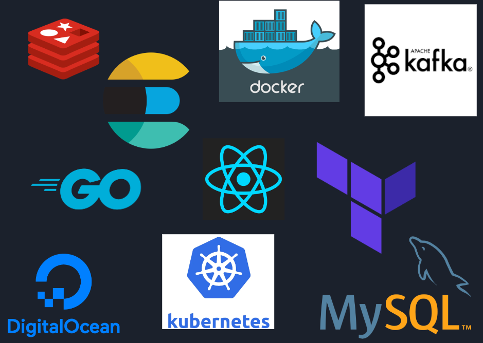
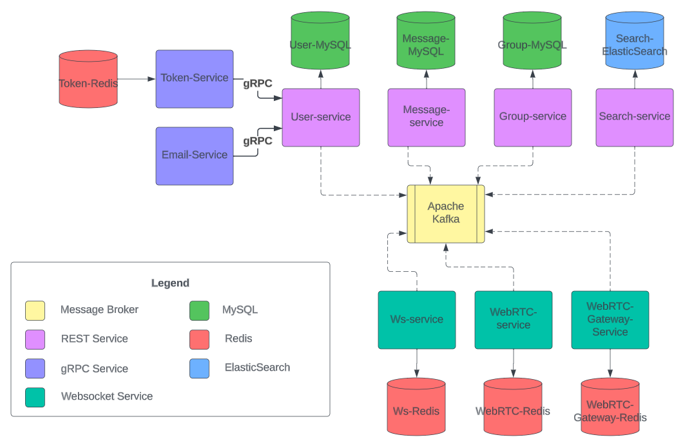
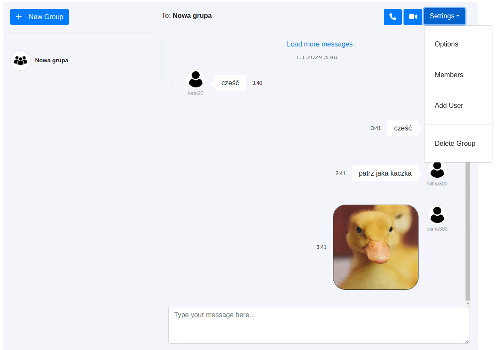
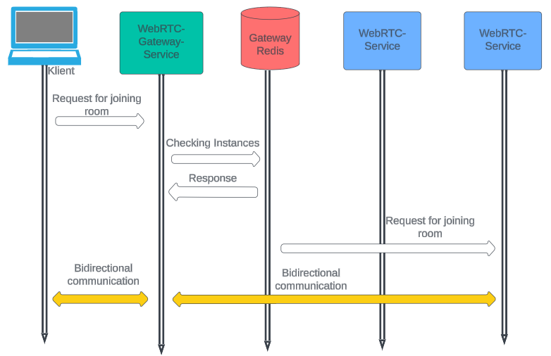
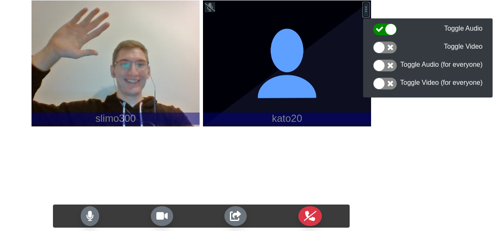
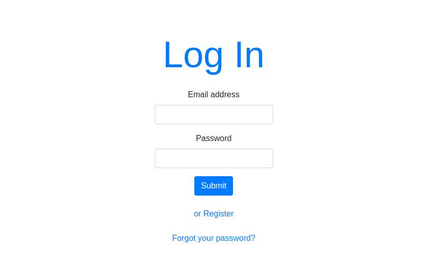
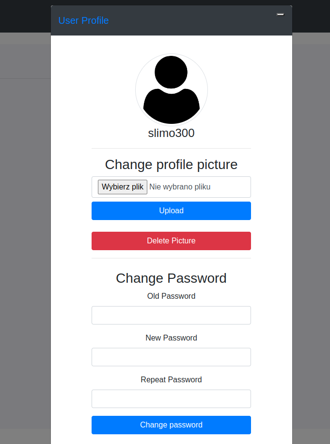
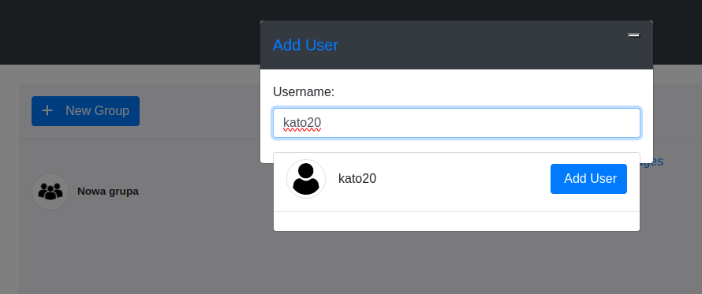

# MicroservicesChatApp

## This is an example Golang microservice application build in educational purposes.

The goal of this project is to build microservice application with functionality that encapsulates: 
- sending text messages
- sending files
- videocalls in group
- rights system for groups
- ability to add and delete members from group
- deleting messages from group
- muting audio and video tracks

Application is based on microservices and it is horizontally scallable.

This application consists of: 

1. **user-service** - REST service handling user profiles (profile pictures), registration, login, logout and password reset.
2. **email-service**  - gRPC service to which **user-service** connects. Is sends verification and reset password emails.
3. **token-service** - gRPC service working with redis to store and handle tokens.
4. **group-service** - REST service handling chat groups, invites to them and user rights in context of a group.
5. **message-service** - REST service for obtaining and deleting messages, it also handles file uploads.
6. **ws-service** - WS service working with websocket connections (uses REST to establish them).
7. **search-service** - REST service working with elasticsearch to query user index to implement 3-gram analyzer for user search recommendations.
8. **webrtc-service** - service responsible for videocalling functionality.
9. **webrtc-gateway-service** - a dedicated service responsible for connecting user to instance of webrtc-service that handles room he requested. For performance reasons, one room is always assigned to one **webrtc-service** instance. 
10. **frontend** - React frontend for application

Application makes use of multiple database technologies like MySQL, ElasticSearch and Redis. It also uses DigitalOcean Spaces as a file storage and Apache Kafka as a message broker. Tech in use:

## Application architecture
The whole backend structure of application presents itself like so:

## Solutions

### Websocket scaling
For application to be horizontally scallable stateful parts of our system like **ws-service** instances had to overcome their scalability issues. To achieve synchronization across **ws-service** instances every instance becomes Kafka consumer (when other services use Kafka for updating their database, they form collective Consumer Group),

### WebRTC-service scaling
The same applies for webrtc-service, although in this case to make application more effective, other approach was used. New service called WebRTC-Gateway-Service was build to enable 

### File uploading with presigned urls
To protect application from sending files too many times it is send straight forward from React application with use of so called pre-signed URLs. They are generated by backend appliaction and sent on user demand for the exact file that user specified (user has to provide file name and size when generating URL). when message is sent through websocket it only contains identifiers of files that are already uploaded to Spaces.

## Application presentation

### Chat window

### Videocall window

### Login form

### Profile modal window

### User rigts modal window

### Adding user modal window

